# desafio-programa-o-orientada-a-objetos-dio-java

classDiagram
    Smartphone ..|> TocadorDeMusica : Implementa
    Smartphone ..|> AplicativoDeLigacao : Implementa
    Smartphone ..|> Navegador : Implementa
    class Smartphone {
        <<interface>>
    }

    class Iphone { 
    }
    class TocadorDeMusica {
        +tocar() void
        +pausar() void
        +selecionarMusica() void
    }
    class AplicativoDeLigacao {
        +ligar() void
        +atender() void
        +iniciarCorreioDeVoz() void
    }
    class Navegador {
        +exibirPagina() void
        +AdicionarNovaAba() void
        +atualizarPagina() void
    }
    Iphone --|> TocadorDeMusica : Ipod
    Iphone --|> AplicativoDeLigacao : Phone
    Iphone --|> Navegador : Safari

